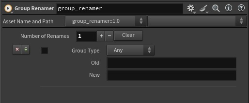

# houdini-hda-group_renamer
Houdini hda to quickly rename points/prims/vertex groups.
You can replace parts of the group name easily. You only need to type what you want to replace.
Comes handy when you import a model and you want to rename groups in bulk.

